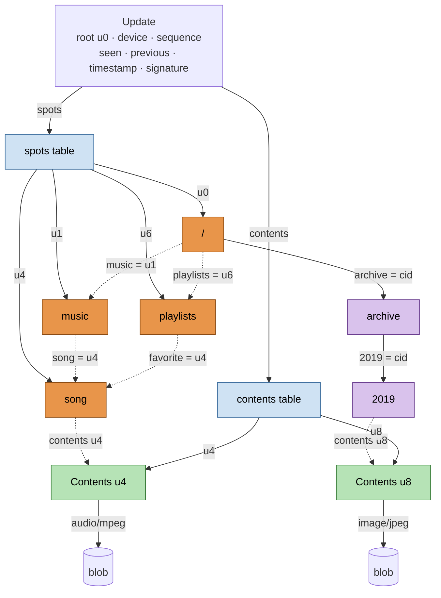
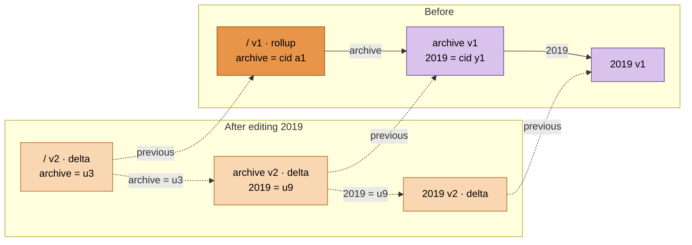
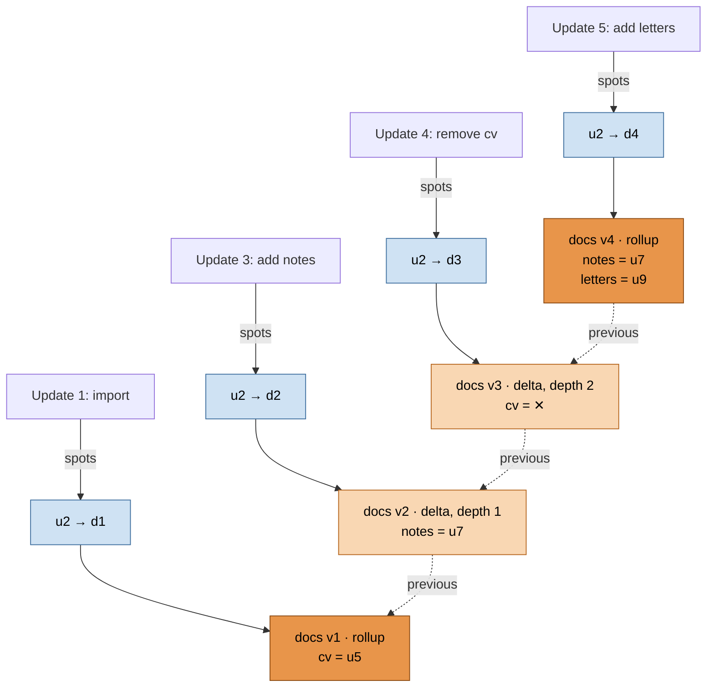
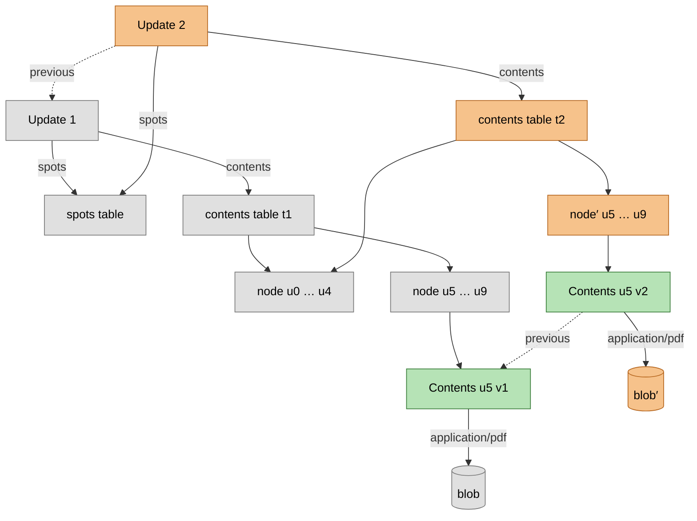
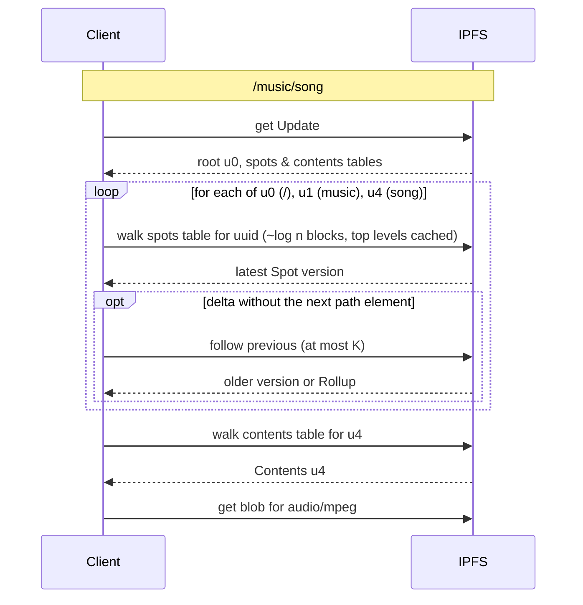
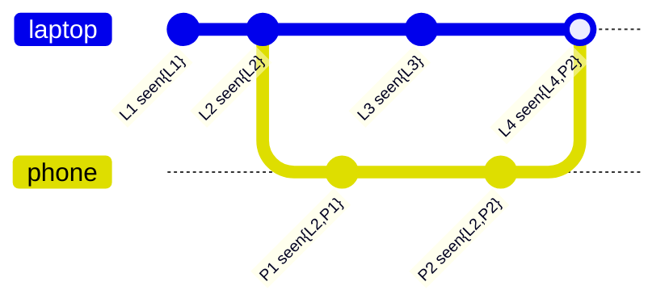
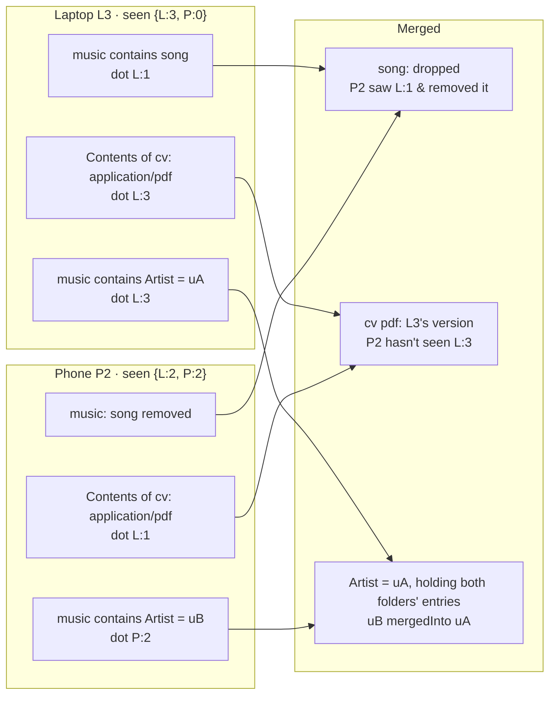
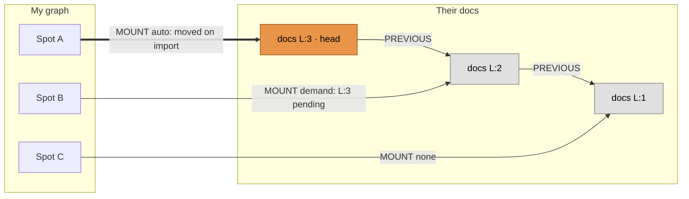

# Graph Structure

I am working on a collaborative file system for public information.

The structure is published to IPFS & indexed locally in Janus Graph. The data is in IPFS.

Each device runs its own Janus Graph & IPFS client. IPFS holds the signed, content-addressed record of each user's tree; Janus Graph holds a local, queryable view built from those records, fetched on demand. Janus Graph must always be rebuildable from IPFS except for unpublished edits, the device's `sequence` counter, & its keys.

What is published is split in two:

* **Structure:** `Spot`s, each found by UUID through a table. A `Spot` links to its children either by UUID, following them as they change, or by CID, freezing them at a particular version. Because parents usually link children by UUID, changing a `Spot` never requires changing the `Spot`s above it, & a `Spot` can have any number of parents. Each `Spot` version is stored as a delta against its previous version, & chains of deltas are periodically consolidated into a `Rollup`, so unchanged information isn't copied over & over.
* **Contents:** the representations of a `Spot` live in a separate `Contents` document, also found by UUID through a table. Editing a file's contents never touches the structure, & many `Spot`s can share one `Contents`.

Nothing in an `Update` summarizes the whole graph, so publishing never recalculates it & readers download only the portions they walk.

See `update structure options.md` for diagrams of the alternatives that were considered.

Legend for the diagrams below: 🟧 dark orange nodes are `Rollup`s, light orange nodes are deltas, 🟪 purple nodes are frozen versions reached by CID, 🟩 green nodes are `Contents`, 🟦 blue nodes are tables, ⬜ grey nodes are reused from an earlier `Update`, solid arrows are links by CID, & dashed arrows are links by UUID or `previous` links.

## Published Structure

### Updates

An `Update` is a DAG-CBOR document:

```
Update {
  device,
  sequence,
  root:      <uuid>,
  spots:     <ordered Merkle search tree of uuid → Spot cid>,
  contents:  <ordered Merkle search tree of uuid → Contents cid>,
  seen:      { <device>: <sequence> },
  previous:  <cid of the prior Update from this device>,
  timestamp,
  signature,
}
```



`song` is reachable as both `/music/song` & `/playlists/favorite`, & neither path is privileged. `archive` & everything beneath it were imported once & are linked by CID, so they need no entries in the `spots` table.

`spots` & `contents` are deterministic ordered Merkle search trees, like the one used by the AT Protocol, so the same set of entries always has the same root CID, & two roots can be diffed by skipping identical subtrees. Publishing a change to one `Spot` or `Contents` rewrites only its new version & the ~log *n* table blocks above its entry.

`root` is the UUID of the user's root `Spot`. It is set once & never changes.

`seen` is a version vector recording, for every device of this user, the highest `sequence` merged into this `Update`.

`previous` is kept as an audit trail. It is not needed to determine current state.

`timestamp` is informational only & plays no role in ordering or merging.

`signature` is an Ethereum EIP-712 typed structure over the `root`, `spots`, `contents`, `seen`, `previous`, `sequence`, `timestamp`, & `device`.

Updates are made public by broadcasting the author and CID via libp2p. Also, a simple Ethereum contract will contain a map of *`Address`* to a map of uint128 *`Device Id`* to most recently recorded *`CID`*.

### Spots

Each version of a `Spot` is a DAG-CBOR document:

```
Spot {
  uuid,
  previous:    [ <cid of prior version> ],
  dot:         { device, sequence },
  depth,
  contains:    { <path>: <uuid> | <Spot cid> | null },
  mounts:      { <mount key>: { order, target: <version> | <path>, creator?, processing } | null },
  masks:       { <path or mimetype>: true | null },
  contents?:   <uuid> | null,
  mergedInto?: <uuid>,
}
```

The `uuid` is a UUIDv7 set at the point of creation which stays the same across updates, renames, & moves.

`previous` lists the CID(s) of the version(s) of this `Spot` it replaces. There is more than one entry when concurrent versions from different devices were merged.

`dot` records the device & `sequence` of the `Update` that wrote this version.

`contents` references a `Contents` document by UUID. A `Spot` with no representations, such as most folders, has none.

`mergedInto` is set only on the final version of a `Spot` that was merged into another (see **Merging**).

#### Links by UUID & by CID

A link by **UUID** follows its target: it is resolved through the `spots` table of the `Update` being read, so it always reaches the target's latest version. Every `Spot` linked to by UUID, plus the `root`, has an entry in the `spots` table.

A link by **CID** is frozen: it always reaches that exact version. UUID links within a frozen version still follow their targets. A subtree linked by CID throughout, such as a one-time import, is frozen entirely & needs no table entries.

Editing a frozen `Spot` **thaws** it: the edit creates a new version with an entry in the `spots` table, & the parent's link is changed from the CID to the UUID. If the parent was itself frozen, it thaws too, & so on up to the first ancestor linked by UUID. This happens once; afterward, edits to the thawed `Spot` change nothing above it.



Instead of thawing, an author may deliberately re-freeze the parent's link at the edited `Spot`'s new CID, which gives the parent a new version as well.

#### Deltas & Rollups

A **delta** lists only the entries that changed since the version in `previous`. A `null` value records the removal of an entry. `depth` counts the deltas since the last `Rollup`.

A **`Rollup`** has a `depth` of 0 & lists every entry, each with the `dot` that last wrote it. Removed entries are simply absent, so removal markers only live until the next `Rollup`. A `Rollup` still links `previous` for history.

The first version of a `Spot` is always a `Rollup`. Thereafter, a `Rollup` is written in place of a delta when:

* the delta's `depth` would exceed *K* (16 by default), or
* the version merges concurrent versions from different devices, so later reads never have to merge two chains.

An author may also roll up a `Spot` early, such as one whose path is read frequently. Because `Rollup`s are part of signed `Update`s, other clients can rely on them without walking the chain themselves.

When a `Rollup`'s `contains` grows past a few thousand entries, it is stored as its own ordered Merkle search tree of *`path`* → *link* rather than inline.



This example uses *K* = 2 so a `Rollup` appears quickly:

* `/` links `docs` by UUID `u2`, so none of these changes create a new version of `/`.
* Resolving `docs/cv` in Update 3 reads `docs v2`, which doesn't mention `cv`, so it follows `previous` to `docs v1`, which does.
* Update 5 would take `docs` to depth 3, so `docs v4` is a `Rollup`, & the removal marker for `cv` is gone.

### Contents

A `Contents` document is never a delta:

```
Contents {
  uuid,
  previous:        [ <cid of prior version> ],
  dot:             { device, sequence },
  representations: { <mimetype>: <blob cid> },
}
```

Editing a representation writes a new `Contents` version & updates its entry in the `contents` table. No `Spot` changes.



`Contents` never reference `Spot`s, so they cannot form cycles, & unreferenced `Contents` can be found by reference counting.

### Resolving Over IPFS

A client without the user's tree in Janus Graph, such as one following a mount into a foreign graph, resolves directly against IPFS, fetching only what the walk touches:



Each path segment linked by UUID costs a table lookup plus at most *K* + 1 fetches. A segment linked by CID skips the table lookup.

## Local Structure

### Roots

The Janus Graph starts with a `Users` node off which there are `INCLUDES` edges, each of which has a unique `author` attribute containing an Ethereum address, and connects to a `User` node.

Each `User` has a `ROOT` edge to the `Spot` for the root of their tree, & a `DEVICE` edge per device, with a `device` GUID, to a `Head` node recording the `sequence`, `cid`, & `seen` of the most recently imported `Update` from that device.

If a user has never connected an Ethereum wallet, then their changes are stored under the `User` for the null address: `0x000…`. They are unable to publish `Update`s until they connect a wallet so they can sign them.

When a user connects a wallet for the first time, the null user's `Spot`s & `Contents` are reassigned to the `User` for that address.

### Spots & Contents

Each version of a `Spot` or `Contents` is its own vertex, keyed by `owner`, `uuid`, & `dot` together, with a composite unique index. The `dot` picks out exactly one position in the `previous` history. Keying without `owner` would allow another user to publish a document with the same UUID & capture links pointing at it.

`cid` is an indexed property rather than part of the key. It is used to follow links by CID & to check that a fetched block is the version expected.

Each version has outgoing `PREVIOUS` edges to the version(s) it replaces, mirroring `previous` in IPFS. The newest version, holding the **merged** state from every device of that user, is the **head** of the chain, & is flagged as such so it can be found by `owner` & `uuid` alone.

The head carries the complete set of outgoing edges, with all deltas applied, so path walks follow edges directly & delta chains cost nothing at read time locally. When a new head arrives, its outgoing edges are the old head's with the new delta applied; they are moved from the old head rather than copied. An older version that a mount or a link by CID still points at keeps a complete copy of its own edges. Other older versions keep only their `PREVIOUS` edges & `cid`, & are rebuilt from IPFS if ever needed.

When a new head arrives, incoming edges pointing at the old head are moved according to their policy: `CONTAINS` edges linked by UUID & `CONTENTS` edges are always moved, as if `auto`; `CONTAINS` edges linked by CID are never moved, as if `none`; & `MOUNT` edges follow their `processing` (see **Mounts**).

`CONTAINS`, `MOUNT`, `CONTENTS`, & `REPRESENTATION` are real edges between vertices. `CONTAINS` edges record whether the published link is by UUID or by CID. A `Spot` may have any number of incoming `CONTAINS` edges, & many `Spot`s may have a `CONTENTS` edge to the same `Contents`. Links by UUID permit cycles, so recursive traversals must use `simplePath()` or a depth limit.

A vertex that hasn't been fetched yet is a `Stub`: only its `owner`, `uuid`, & `cid`, with its `dot` filled in once it is fetched. It is filled in from IPFS the first time a traversal needs it, so a user's graph is downloaded only as far as it is explored.

### Local Edits

The first edit to a `Spot` or `Contents` since the last publish creates a new head version, marked `dirty`, with a pending `dot` of *(this device, `sequence` + 1)* & a `PREVIOUS` edge to the old head. Further edits before publishing apply to that same version. Incoming edges are moved to it as for any new head, so local edits are visible immediately in all queries.

There is no separate `Write Layer`. Selecting what to publish is a filter over the `dirty` vertices.

### Publishing

1. Select some or all of the `dirty` vertices.
2. Encode each `dirty` `Contents` in full, setting `previous` to its current `cid` & `dot` to the pending dot, & insert it into the `contents` table.
3. Encode each `dirty` `Spot` as a delta, or as a `Rollup` if the rules above call for one, & insert it into the `spots` table. Thaw any frozen `Spot`s that were edited.
4. Drop `Contents` that no `Spot` references any more from the `contents` table.
5. Increment the device's `sequence`, fill in `seen`, `previous`, & `timestamp`, & sign.
6. Write the blocks to IPFS, pinning the `Update` recursively.
7. Only then clear `dirty` & update the vertices' `cid`s & the device's `Head`.

The work is proportional to what changed. Because CIDs are deterministic, a crash between 6 & 7 is recovered by publishing again, which reproduces the same blocks.

### Processing Foreign Updates

When an `Update` arrives, the `signature` is used to derive the Ethereum address, and the `device` GUID is used to find the `Head`.

If the `sequence` is not above the `Head`'s, the `Update` is ignored. If the same `device` & `sequence` arrive with a different CID, the device has equivocated; the first one seen is kept & the conflict is flagged.

Otherwise:

1. Diff `spots` & `contents` against the `Head`'s. This yields exactly the UUIDs that changed.
2. For each changed UUID that Janus Graph has already fetched, follow `previous` back to the version it has, or to a `Rollup`. Add a vertex for each new version, linked by `PREVIOUS` edges into the existing chain, & merge them (see **Merging**). The result becomes the head.
3. Move incoming edges to each new head according to their policy, & record pending versions for `demand` mounts.
4. Changed UUIDs that were never fetched just have their `Stub`'s `cid` updated.
5. Update the `Head`.

If there is no `Head`, only the `root` is created, as a `Stub`.

Intermediate `Update`s don't need to be fetched, & frozen versions never change. The `previous` chains can be followed afterwards to fill in history as desired.

### Merging

Each device signs its own chain. When a device imports another device's `Update`, it merges it into its own graph & records what it has merged in `seen`.



If one device's `seen` covers everything in another's, the dominating `Update` is simply taken. Once devices have synced, this is the normal case. Above, `L4` dominates `P2`.

Otherwise the `Update`s are concurrent, like `L3` & `P2`, & are merged per `Spot` & per `Contents`, entry by entry, where an entry is a `contains` name, a mount, a mask, a `contents` reference, or a representation:

* An entry present on one side & absent from the other survives, unless the side missing it has already `seen` the entry's `dot`, in which case it was deliberately removed.
* Two `contains` entries with the same name that point at different UUIDs, where neither target has `contents`, are two folders created independently for the same purpose, such as when two devices import the same library. They are merged: the lower UUID survives & receives the union of both folders' entries, merged recursively, & the other gets a final version with `mergedInto` set to the survivor. Its `spots` table entry remains so that links to it from elsewhere are redirected.
* Any other two different values for the same key, each unseen by the other side, are a genuine conflict. The one with the higher *(`sequence`, `device`)* wins, & the loser is kept as a conflicted copy.



Merging works per `Spot`, not per path, so a `Spot` with several parents is merged once regardless of how many paths lead to it.

Unpublished local edits hold a pending dot that no incoming `Update` has seen, so they always survive an import.

The merge result depends only on which `Update`s are present, not on the order they arrived or on any clock, so all devices converge.

## User Graphs

User graphs are `Spot` nodes connected to other `Spot` nodes by `CONTAINS` edges with a `path` attribute, unique per `Spot`, representing an element in the path for resolving a resource.

### Blobs

Each `Contents` can have `REPRESENTATION` edges, which have a `mimetype` attribute that must be unique for that `Contents`.

Mimetypes are normalized disregarding any clarifying attributes like `;charset=utf8` for the purposes of uniqueness.

Each `REPRESENTATION` edge leads to a `Blob` node which has a `cid` property with the IPFS content id of that blob.

### Mounts

In addition to `CONTAINS` edges, `Spot`s can have `MOUNT` edges. An optional `creator` gives the Ethereum address of the user whose graph the target is in if it is not the current user. A mount's `target` is either:

* a **version**: `{ uuid, device, sequence, cid? }` names one position in the target's `previous` history, the version whose `dot` is that `device` & `sequence`. Since `sequence` is counted per device, `device` is needed to make the position unique.
* a **path**, resolved from the creator's root, which breaks if the target is moved.

A mount's `processing` says what happens to it when newer versions of its target arrive:

* `auto`: it is moved to the head of the `previous` chain without interaction. This is a floating mount.
* `delay:<timestamp>`: it is moved to the head automatically once `timestamp` has passed.
* `demand`: it is moved only after the user confirms. Until then, the newer version is offered as pending.
* `none`: it is never moved. This is a pinned mount.

`processing` is published so all of a user's devices apply the same policy, but it is carried out only by the mounting user's own devices. When one of them moves a mount other than `auto`, the move is an ordinary edit, published as a new version of the mounting `Spot` with the new `target`. Clocks therefore don't affect convergence: `delay` only decides when a device makes the edit.

Other users reading the mount through IPFS resolve an `auto` mount to the target's latest version & any other mount to exactly the recorded version.

A version is resolved by looking the `uuid` up in the creator's `spots` table & following `previous` from the latest version until reaching the version with the matching `dot`. The optional `cid` is a hint: when present, that version is fetched directly & accepted only if its `uuid` & `dot` match, which avoids walking the history. The hint is required when the target has no `spots` table entry because it is only reachable through CID links, & it also disambiguates if the target's device has equivocated, publishing two different `Update`s with the same `sequence`.



`MOUNT` edges have an optional `order` property, and they are searched in ascending `order` after any `CONTAINS` edges have been checked.

Mounts allow cycles to exist within the graph, which are detected during dereferencing.

### Deletions

Removing a name, a mount, or a mask writes a `null` entry in the next delta. The marker disappears at the next `Rollup`, where the entry is simply absent.

Removing a representation writes a new `Contents` version without it. Removing a `Spot`'s `contents` writes a `null` `contents` in the next delta.

When an import removes an entry, Janus Graph records a local, unpublished `REMOVED` edge with the `path` or `mimetype` & the removing `dot`, so resolution can distinguish *gone* (HTTP 410) from *never existed* (HTTP 404) even after the marker has been rolled up.

### Masks

To hide a name or a mimetype that would otherwise arrive through a mount, a `Spot` lists it in `masks`. Masks are deliberate, published content, like whiteouts in overlayfs, rather than a record of history.

### Overrides

When a user wants to override a resource in another user's graph, they create a node with that same path under `program → Mïmis → overrides → `*`ETH Address`*.

### Resource Resolution

So, the resolution process for a resource operates as such:

Matching is done through two mechanisms:

On the one hand, the `Accept` header is used. On the other, the resource path can include an `ext` or `type` parameter specifying a file extension *(which is dereferenced in a table of extensions before use)* or mimetype respectively. The presence of one of these is the same as an `Accept` list with a single entry.

If the walk, at a point where the entire path has been consumed, ends on a `Spot` whose `Contents` has a `REPRESENTATION` edge with a `mimetype` matching the first element of the `Accept` list, that `Blob` is returned.

If the walk examines all possible viable `Spot`s without finding the first element of the `Accept` list, each subsequent element is attempted until a resource is found or the list is exhausted.

If the list is exhausted, if the graph didn't ever allow the complete traversal of the path, then a HTTP 404 is returned. Otherwise a HTTP 406 is returned.

The walk is a depth-first traversal starting at the `User`'s `ROOT`:

1. Follow the `CONTAINS` edge matching the next path element. Each time a `Stub` is encountered, fetch its `cid` & fill it in. Each time a `Spot` with `mergedInto` is encountered, continue at the survivor.
2. If there is no matching `CONTAINS` edge, try each `MOUNT` edge in ascending `order`, skipping any name listed in the `Spot`'s `masks`.
3. If no route matches & the `Spot` has a `REMOVED` edge for that path element, traversal terminates with a HTTP 410.
4. On reaching the final `Spot`, follow its `CONTENTS` edge. Representations whose `mimetype` is listed in `masks` anywhere along the walk are not considered.

When accessing files that are from other users' graphs, search the override graph for that user before searching their graph.

### History

The structural history of a `Spot`, meaning its names, mounts, & masks over time, is found by following `previous` from its current version. This is O(versions), works over IPFS, & follows the `Spot` across renames & moves.

The history of a file's contents is found by following `previous` from its `Contents`. Since a rename moves the `Spot` but keeps the same `Contents`, content history also survives renames & moves.

The history of a single representation is found by comparing `representations` between consecutive `Contents` versions.

The history of something deleted first requires finding the last `Update` that still references it.

## Nodes Summary

### Janus Graph

| Node | Attributes | Edges |
| --- | --- | --- |
| `Users` | | • `INCLUDES`s with `author` to `User`s |
| `User` | | • `ROOT` to `Spot` |
| | | • `DEVICE`s with `device` to `Head`s |
| `Head` | • `sequence` number | |
| | • `cid` of the `Update` | |
| | • `seen` version vector | |
| `Spot` | • `owner` address | • `PREVIOUS`s to `Spot`s |
| | • `uuid` | • `CONTAINS`s with `path`, link kind, & `dot` to `Spot`s |
| | • `dot` | • `MOUNT`s with `order`, `processing`, & `dot` to `Spot`s |
| | • `cid` | • `CONTENTS` with `dot` to `Contents` |
| | • `depth` since the last `Rollup` | • `MERGED_INTO` to `Spot` |
| | • `head` flag | • `REMOVED`s with `path` or `mimetype` & `dot` *(local only)* |
| | • `dirty` flag | |
| | • `stub` flag | |
| `Contents` | • `owner` address | • `PREVIOUS`s to `Contents` |
| | • `uuid` | • `REPRESENTATION`s with `mimetype` & `dot` to `Blob`s |
| | • `dot` | |
| | • `cid` | |
| | • `head` flag | |
| | • `dirty` flag | |
| | • `stub` flag | |
| `Blob` | • `cid` | |
| | • `size` | |

### IPFS

| Document | Fields | Links |
| --- | --- | --- |
| `Update` | • `device` GUID | • `spots` to the `Spot` table |
| | • `sequence` number | • `contents` to the `Contents` table |
| | • `root` UUID | • `previous` to `Update` |
| | • `seen` version vector | |
| | • creation `timestamp` | |
| | • EIP-712 `signature` | |
| `Spot` table | • *`uuid`* → *`cid`* entries | • to `Spot`s |
| `Contents` table | • *`uuid`* → *`cid`* entries | • to `Contents` |
| `Spot` *(delta or `Rollup`)* | • `uuid` | • `contains` to `Spot`s, when by CID |
| | • `dot` | • `previous`s to `Spot`s |
| | • `depth` | |
| | • `contains` by UUID | |
| | • `mounts` | |
| | • `masks` | |
| | • `contents` UUID | |
| | • `mergedInto` UUID | |
| `Contents` | • `uuid` | • `representations` to `Blob`s |
| | • `dot` | • `previous`s to `Contents` |
| `Blob` | | |

## Future Work

Initial work is focused on providing a proof of concept. Performance concerns will be addressed down the line.

*K*, the maximum delta chain length, trades storage against read cost & should be tuned with real usage.

Listing a directory with the mimetypes of each child costs a `spots` table lookup & a `contents` table lookup per child linked by UUID. Sorting the children's UUIDs & walking each table once reduces this.

`Spot`s that are no longer linked from anywhere should be dropped from the `spots` table. A full reachability pass is O(*n*) per publish, & reference counting leaks cycles of UUID links, so an incremental approach is needed. It must operate on the merged view, since a `Spot` unreachable in one device's graph may be reachable in another's.

Since `Spot`s link by UUID & deltas aren't complete directories, IPFS gateways cannot resolve paths in the structure. An optional UnixFS export could provide gateway access.

An `auto` mount into another user's graph trusts that user's future behavior: they can change, delete, or repurpose the target. A `processing` of `demand` or `none` mitigates this at the cost of freshness.

Resolving a mount's version without a `cid` hint walks `previous` back from the latest version, which grows with the number of versions written since. Clients should fill in the hint whenever they set or move a mount.

Older versions that nothing points at accumulate in Janus Graph as `PREVIOUS` chains. They could be pruned to their `cid` alone, since they can be rebuilt from IPFS.

Also, there are plans to stand up a cloud version of the system that will track a wider range of users and provide update information for clients that need it.

Additionally, there is hope to somehow incorporate the [Veilid](https://veilid.com) anonymization layer to permit censorship-resistant publishing.

Since the `previous` chain of `Update`s is not needed for current state, content removed from the current graph could be truly removed by unpinning old `Update`s. However, `previous` links on `Spot`s & `Contents` still reference old versions, delta chains reach back to the last `Rollup`, & other nodes may have pinned them, so a policy for this is still needed.

Handling the loss or compromise of a key also needs to be dealt with. One option is to sign `Update`s with a delegated device key, authorized & revocable by the wallet in a signed message, similar to the split between signing & rotation keys in `did:plc`. This would also avoid a wallet prompt on every publish.

One mechanism for providing for the reliability of data is using [Human Passport](https://passport.human.tech) on the user's Ethereum address to reduce Sybils. The popularity of mounted content as well as a rating system can help drive a content recommendation system.

Ideally information could be kept alive for a minimum of cost. Perhaps raising funds through charging for access to the aggregated information in the cloud system to drive large long-term storage in the [Filecoin network](https://filecoin.io) or IPFS accessible pinning in [Fil.One](https://fil.one).
