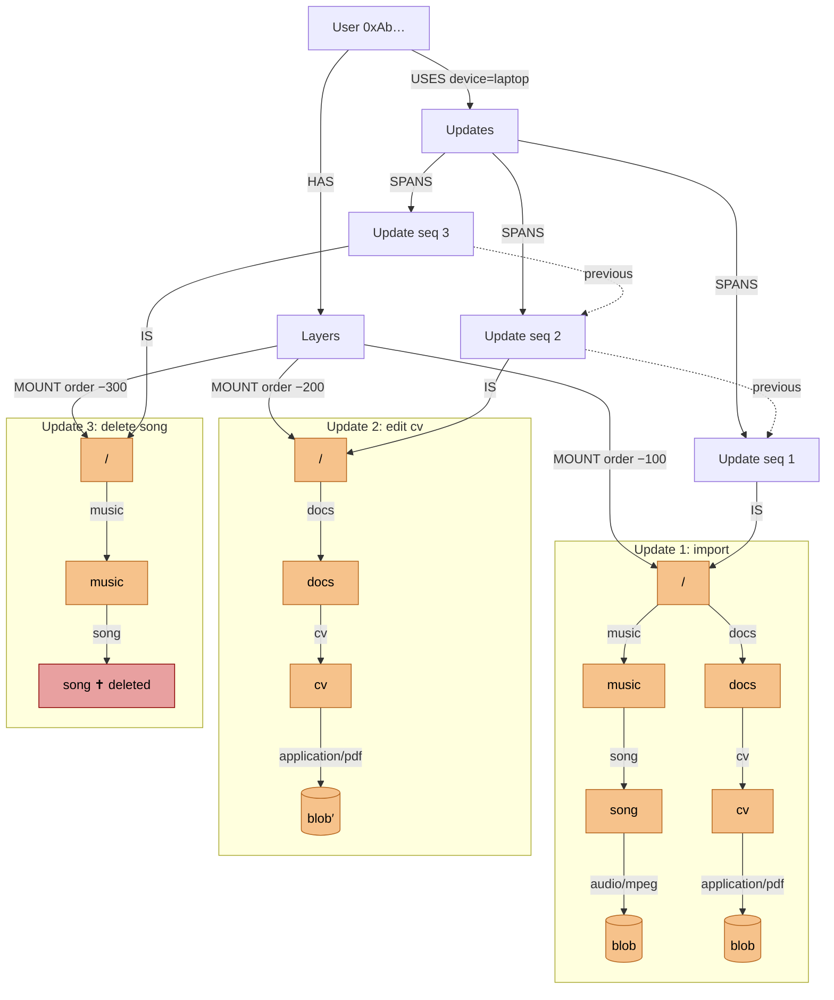
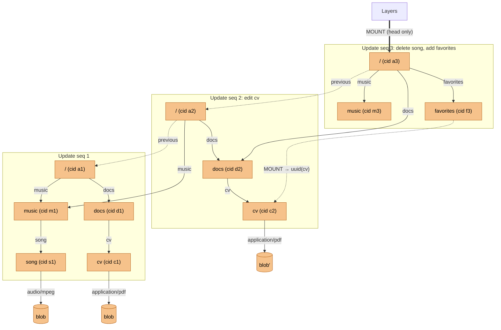
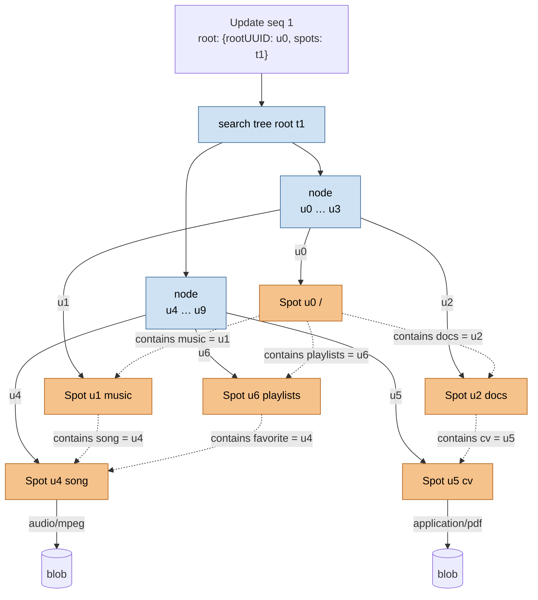
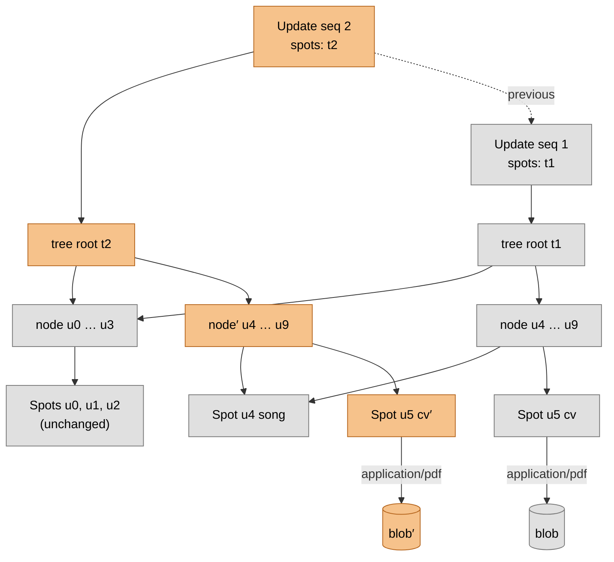
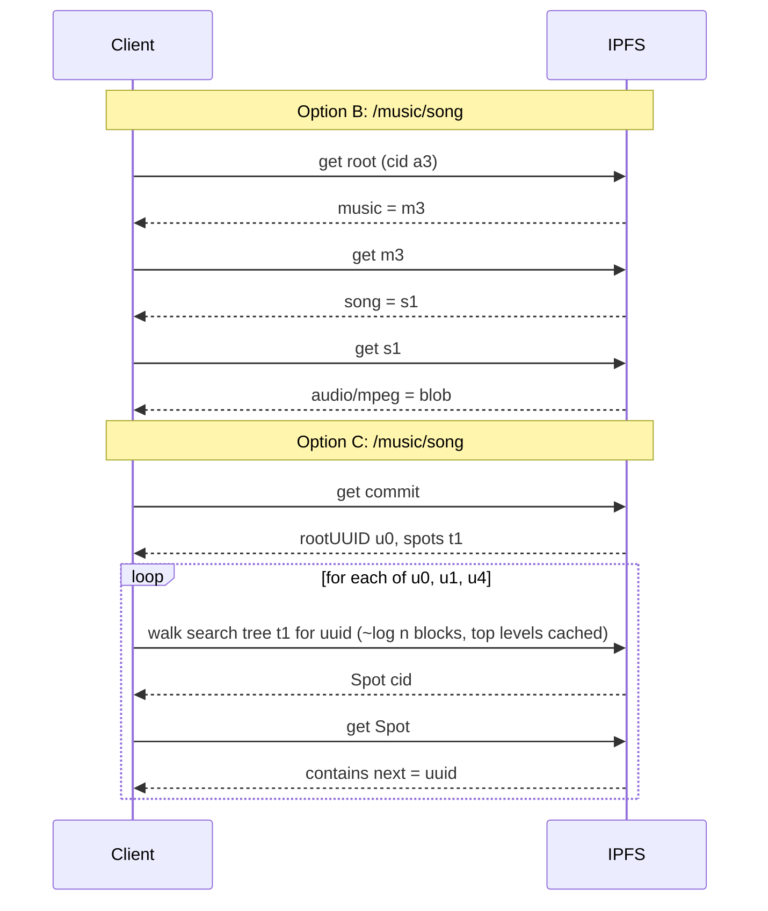
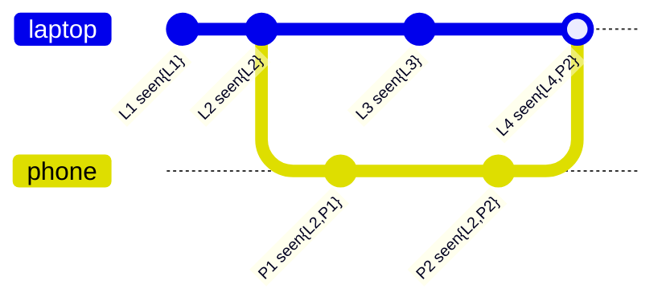
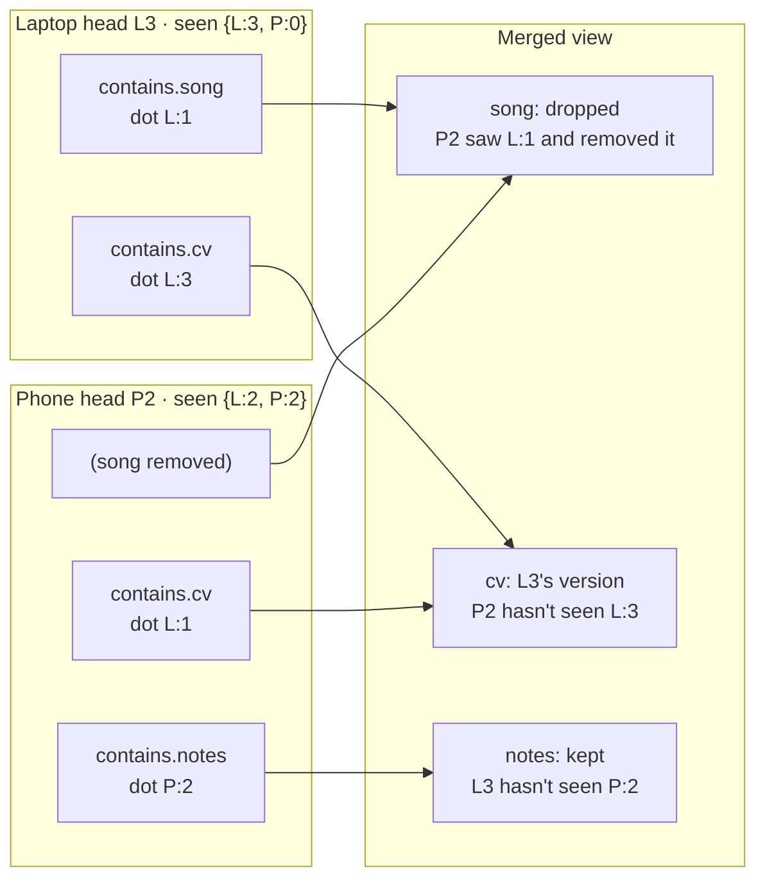

# Update Structure Options

Three candidate layouts for how `Update`s are published and how the trees under them are stored, followed by how multiple devices combine.

The running example is one user with this tree:

```text
/
├── music/
│   └── song  (audio/mpeg)
└── docs/
    └── cv    (application/pdf)
```

Update 1 imports everything. Update 2 edits `cv`. Update 3 deletes `song`.

Legend: 🟧 orange nodes are newly written, ⬜ grey nodes are reused from an earlier update, 🟦 blue nodes are search-tree blocks, and dashed arrows are references by UUID or `previous` links rather than hash links from parent to child.

## Option A: Delta Layers (current document)

Each `Update` holds only the changed nodes plus the intermediate `Spot`s needed to reach them from the root. Every `Update` root is mounted in `Layers` forever, ordered by the negative of its creation time.



Resolving `/music/song` walks layer −300 and hits the tombstone (410). Resolving a path nobody ever created walks every layer before returning 404, so the cost grows with the number of updates. The intermediate `/` and `docs` nodes are rewritten in every delta that touches something below them.

## Option B: Snapshot Merkle Tree

Each `Update` is a complete tree. `CONTAINS` links point at children by CID, so unchanged subtrees are shared between versions, just like git. Only the latest head is mounted. Other paths to a `Spot` are floating mounts by UUID.



- Editing `cv` rewrites `cv → docs → /`: three documents, the depth of the change.
- Update 2's `/` points at the **same** `music (m1)` as update 1, and Update 3's `/` points at the **same** `docs (d2)` as update 2.
- Deleting `song` means `music (m3)` doesn't list it. No tombstone.
- `favorites` reaches `cv` through a floating mount by UUID, so it follows future edits to `cv` without being rewritten when `cv` changes.
- Each folder's CID covers everything below it, so `/ipfs/a3/docs/cv` works in a gateway.

## Option C: UUID Table (everything floating)

Each `Update` root is `{ rootUUID, spots }`, where `spots` is an ordered Merkle search tree mapping UUID → `Spot` CID. `Spot` documents name their children by UUID, so no path is preferred and a `Spot` can have any number of parents.

### Layout of one snapshot



Solid arrows are hash links. Dashed arrows are names, resolved by looking the UUID up in the table. `song` is reachable as both `/music/song` and `/playlists/favorite`, and neither path is preferred.

### Editing `cv` (Update 2)



Only the `cv` document and the search-tree path above its entry are rewritten. `docs` and `/` are untouched because they refer to `cv` by UUID `u5`, which didn't change. The trade-off is that `docs` no longer has a CID covering its contents.

### Resolving a path: B vs C



## Combining Devices

This applies to options B and C. Each device signs its own chain. When a device imports another device's head, it merges it into its own tree and records what it has seen in `seen`.



- After `L3` and `P2`, neither head's `seen` covers the other, so they are **concurrent**: both are mounted and merged entry by entry.
- `L4` has seen `P2`, so it **dominates**: only `L4` is mounted until the phone publishes again.

### Merging concurrent heads



An entry present in one head and absent from another survives only if the head missing it has not already seen the entry's dot. Two different values for the same key, each unseen by the other head, are a real conflict and need a deterministic tiebreak.
